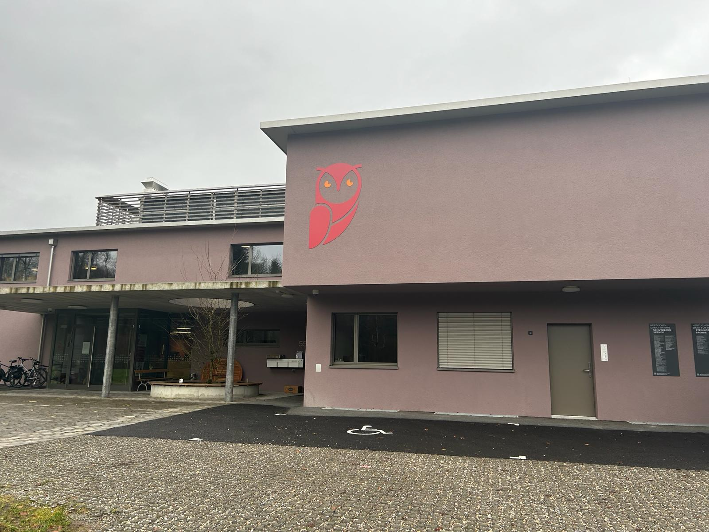

+++
title = "Tierzentrum Bern: Zwischen Pfotenabdrücken und Lebensgeschichten "
date = "2024-02-20"
draft = false
pinned = false
tags = []
image = "img-20240226-wa0005.jpg"
description = "In der heutigen Welt, in der Millionen von Tieren ausgesetzt werden und auf der Strasse leben, bieten Tierheime nicht nur ein Dach über dem Kopf, sondern auch eine Chance auf ein neues Leben und ein liebevolles Zuhause. \n\nMit ihren offenen Türen für diejenigen, die verloren, vernachlässigt oder misshandelt wurden, haben Tierheime eine entscheidende Funktion für den Tierschutz und die Förderung von Adoptionen. Doch hinter den Mauern dieser Einrichtungen verbirgt sich weit mehr als nur temporäre Unterbringungsinstitution. Tierheime sind Orte der Hoffnung, des Mitgefühls und der Chance auf ein neues Leben für jedes Wesen, welches aufgenommen wird."
footnotes = ""
+++


In der heutigen Welt, in der Millionen von Tieren ausgesetzt werden und auf der Strasse leben, bieten Tierheime nicht nur ein Dach über dem Kopf, sondern auch eine Chance auf ein neues Leben und ein liebevolles Zuhause. 

Mit ihren offenen Türen für diejenigen, die verloren, vernachlässigt oder misshandelt wurden, haben Tierheime eine entscheidende Funktion für den Tierschutz und die Förderung von Adoptionen. Doch hinter den Mauern dieser Einrichtungen verbirgt sich weit mehr als nur temporäre Unterbringungsinstitution. Tierheime sind Orte der Hoffnung, des Mitgefühls und der Chance auf ein neues Leben für jedes Wesen, welches aufgenommen wird. 



*Anna Guggisberg, Sarah Potjer*

<!--StartFragment-->

Es ist ein grauer, verregneter Wintertag, als wir mitten im Wald, im Tierzentrum Bern eintreffen. Gegenwärtig ist nicht viel los, einige Autos stehen auf dem Parkplatz vor dem Tierzentrum und Fahrräder reihen sich sauber im Fahrradständer. Das Gelände selbst ist weitläufig, aber von einem hohen Zaun umschlossen. 

Ein Pärchen kommt gerade Hand in Hand aus der Eingangstüre geschlendert und schlendern auf ihr Auto zu, ob sie wohl gerade von einem Besuch ihres zukünftigen tierischen Begleiters kommen? Wir gehen den kiesigen Weg hinauf zur Eingangstüre. Im Innern des Gebäudes stehen wir neben einer grossen Theke, hinter der sich die unterschiedlichsten Menschen befinden und in Gespräche vertieft sind. Wir werden von Jil Heimann begrüsst, sie ist eine achtzehnjährige Tierpflegerin, welche seit 2021 im Tierzentrum arbeitet und nun im dritten Lernjahr ist. Als sie uns das Tierzentrum zeigt und Dinge über die Tiere hier erzählt, fangen ihre blauen Augen augenblicklich an zu strahlen. Wir spüren: Sie liebt ihre Arbeit und sieht darin eine sinnvolle Tätigkeit. 

#### Herausforderungen im Tierzentrum Bern

Um 8 Uhr morgens beginnt im Tierzentrum Bern der Arbeitsalltag, erzählt uns Jil Heimann. Gemeinsam werden die vielfältigen Aufgaben des Tages verteilt. Ein wesentlicher Bestandteil ist die gründliche Reinigung der Gehege, denn im Laufe der Stunden sammelt sich so einiges an. Ebenso steht die Fütterung der Tiere auf der Tagesordnung, schließlich muss sichergestellt sein, dass alle Bewohner des Tierheims gut versorgt sind. Neben Jil Heimann gibt es noch sieben Tierpfleger und drei Lehrlinge, dazu noch einige Mitarbeitende in der Administration. Welche bei der Pflege und Vermittlung von Katzen, Hunden und verschiedenen Kleintieren helfen.

Dem Tierzentrum Bern sind angemessene Haltungsbedingungen sehr wichtig. Deswegen beschweren sich teilweise Personen in den Rezensionen des Tierzentrums über die hohen Anforderungen. Ein älterer Herr, 85 Jahre alt, beklagt sich zum Beispiel darüber, keinen Welpen mehr adoptieren zu können, und hinterlässt eine schlechte Rezension. Jugendliche, fasziniert von der Idee, einen  Pitbull zu haben, verstehen nicht, dass das Tierheim diese Hunde nur Interessierten ab dem Alter von 25 Jahren zur Adoption überlässt. Auch ihre Unzufriedenheit manifestiert sich online in Beschwerden und teils unhöflichen Ton.

Jil Heiman betont demgegenüber, wie wichtig es sei, dass das Tierzentrum Bern seine Verantwortung für angemessene Haltungsbedingungen ernst nimmt, auch wenn das zuweilen auf Unverständnis und Kritik stosse. Sie berichtet sogar von Rezensionen, die das Tierheim und seine Praktiken als minderwertig abstempeln: "Es gibt viele Menschen, die sagen, das Tierheim, oder wir, sind einfach schlecht," sagt sie uns. Sie erzählt uns auch von jenen, die sich an den strengen Richtlinien des Tierzentrums stoßen. In den Gängen des Tierzentrums manifestiert sich somit nicht nur die Suche von Menschen nach tierischer Gesellschaft, sondern auch die Herausforderung für die Tierheim-Betreibenden, den Bedürfnissen der Tiere gerecht zu werden und zugleich die Erwartungen der potenziellen neuen Besitzer zu berücksichtigen.

> Es gibt viele Menschen, die sagen, das Tierheim, oder wir, sind einfach schlecht…
>
> \-Jil Heimann

#### Das Tierwohl im Fokus 

Das Berner Tierzentrum übernimmt eine zentrale Funktion im Bereich des Tierschutzes, indem es als Auffangstation für Tiere in Not agiert. Es nimmt Tiere auf, deren Besitzer sich nicht länger um sie kümmern konnten oder die ausgesetzt wurden. Auch beherbergt das Tierzentrum Tiere,  die bei Hofkontrollen beschlagnahmt wurden. Die Mitarbeiterinnen und Mitarbeiter, darunter Jill Heimann, setzen sich intensiv für das Wohl dieser Tiere ein, indem sie Schutz, Pflege und die Aussicht auf ein neues, liebevolles Zuhause bieten.

In enger Anlehnung an die Tierschutzgesetze gewährleistet das Berner Tierzentrum eine umfassende Betreuung der gehaltenen Tiere. Dies beinhaltet regelmäßige soziale Interaktionen mit Menschen und Artgenossen, eine artgerechte Unterbringung im Freien sowie die Bereitstellung von Futter, Wasser, erhöhten Liegeflächen und Unterschlupfmöglichkeiten. Die Mitarbeiterinnen und Mitarbeiter, wie Jill Heimann, setzen sich dafür ein, die Bedürfnisse jedes einzelnen Tieres individuell zu berücksichtigen. 

Das Berner Tierzentrum spielt nicht nur eine essenzielle Rolle bei der direkten Pflege von Tieren, sondern engagiert sich auch aktiv in der Sensibilisierung der Gesellschaft für Tierschutzthemen. Durch Aufklärungsarbeit, Schulungen und Veranstaltungen trägt das Zentrum dazu bei, das Bewusstsein der Bevölkerung für die Bedürfnisse von Tieren zu stärken und eine tierfreundliche Kultur zu fördern.

Dem Berner Tierzentrum ist auch sehr wichtig, dass Kinder lernen, wie sie richtig mit Tieren umgehen und was sie tun können, um Tieren zu helfen. Deshalb hat das Berner Tierzentrum den sogenannten Bubo-Club gegründet. Dieser bietet Kindern zwischen 9 und 13 Jahren die Möglichkeit, sich aktiv am Tierschutz zu beteiligen. Die Kinder lernen zum Beispiel Futterhäuser für Igel zu bauen, basteln Spielzeug für Tierheimkatzen oder besuchen eine Wildtierstation, in der kranke oder verlassene Wildtiere gepflegt und aufgezogen werden. Zudem gibt es Nachmittage, an denen die Kinder aktiv im Tierheim helfen. Diese Einblicke in die Arbeit des Tierzentrums fördern nicht nur das Verantwortungsbewusstsein der jungen Mitglieder, sondern tragen auch zur Schaffung einer tierfreundlichen Gemeinschaft bei.



Wie kann man das Berner Tierzentrum unterstützen 

Da es keine Unterstützung des Kantons erhält, spielen Spenden und Mitgliedschaften für das Tierzentrum eine entscheidende Rolle. Sehr willkommen sind Geldspenden, Futterspenden, aber auch Halsbänder etc. Das Tierzentrum informiert gerne darüber, was aktuell am dringendsten benötigt wird. Ein Anruf genügt!  Besondere Aufmerksamkeit gilt auch dem Chippen von Tieren, da das Tierzentrum viele Findeltiere betreut. Die Kennzeichnung durch einen Mikrochip hilft, verlorene Tiere zu identifizieren und sie sicher zurückzubringen. Jeder Beitrag, ob materiell oder immateriell, trägt dazu bei, das Wohlergehen der Tiere im Berner Tierzentrum zu fördern. 



#### Von der Strasse ins Herz 

Wer ein Tier in seiner Familie aufnehmen will, muss einiges beachtet werden. Dass der neue Besitzer gutes Futter hat, das Tier auf Krankheiten und Impfungen abgecheckt ist und am wichtigsten, dass das Tier und die Familie zusammenpassen. Aber das Tierheim selbst muss natürlich ebenfalls einige Dinge beachten, wie dass das Tier gut erzogen ist und die bestmöglichen Chancen hat in der Familie klarzukommen. Das Überprüfen der Passung von Tier und Mensch übernehmen im Tierzentrum Bern Tierpflegende wie Jil. Doch bevor ein Tier vermittelt werden kann, sind viele andere Dinge nötig.

Als Erstes die Aufnahme. Im Tierzentrum gibt es einen Raum, zu dem die Polizei uneingeschränkten Zugriff hat, denn es ist häufig sie, die ein Tier zum Tierzentrum bringen. Es handelt sich um einen kompakten Raum, der zwei kleine Bereiche für Hunde sowie einige Käfige für Katzen und andere kleine Tiere enthält. Zusätzlich ist er mit allen grundlegenden Bedürfnissen wie Futter, Wasser und Katzenklos ausgestattet.

Am Tag nach ihrer Aufnahme werden die Tiere von den Tierpflegenden versorgt. Der örtliche Tierarzt untersucht die Neulinge und stellt sicher, dass sie keine Krankheiten und Infektionen haben. Wenn die Tiere gesund sind, werden sie zu ihren Artgenossen gelassen, wo sie täglich betreut werden, bis sie eine passende Familie gefunden haben.

Das spezielle System für Hunde erleichtert ihre schrittweise Wiedereingliederung in die Gesellschaft. Alle Tierpflegenden bekommen einen Pflegehund , sie gewöhnen den Hund langsam wieder an die Umgebung. Bei der Zuweisung der Hunde wird, so gut es geht, auf die Kompatibilität von Mensch und Hund geachtet

<!--StartFragment-->

Auch Jil Heimann hatte schon einige Pflegehunde, darunter auch Problemhunde wie Maddox. Maddox ist ein Mischlingshund aus Rumänien und wurde von Jil als Pflegehund aufgenommen. Er hatte unter anderem Schwierigkeiten mit anderen Hunden und musste fast alles von neu auf erlernen. Jil hat über ein Jahr mit Maddox trainiert und ihm so die für ihn neue und gefährliche Welt näher gebracht. 

“Maddox kam schon zwei Mal von einem Probewohnen zurück,” berichtet Jil,” beim ersten Mal war er einfach zu wenig ausgelastet und hat Dinge kaputt gemacht. Ich hatte ihn schon öfters bei mir und dann war er ruhig, aber das liegt vermutlich daran, dass ich ihn richtig ausgelastet habe. Beim zweiten Mal war er zu kompliziert mit den anderen Hunden und die Frau, bei der er war, wusste nicht mehr weiter.” Das Training mit Maddox hat sich aber ausgezahlt, denn er hat im Januar 2024 eine neue Familie gefunden. 

> Maddox kam schon zwei Mal von einem Probewohnen zurück, beim ersten Mal war er einfach zu wenig ausgelastet und hat Dinge kaputt gemacht …
>
> \-Jil Heimann

Am Beispiel von Maddox kann man sehen, dass die Dauer bis zur Adoption stark variieren kann, aber eines bleibt: Die Adoptionsdauer eines Hundes ist viel länger als die einer Katze oder eines anderen Kleintiers. Dies hat  verschiedene Gründe: Einerseits lebt ein Hund häufig länger bei einer Familie als ein Kleintier, andererseits ist es oft wichtiger, eine gute Kompatibilität zu einem Hund zu haben, aus Gründen wie die Hundeführung. Aber insgesamt ist es nicht so wichtig, wie lange ein Tier auf seine Familie warten muss, solange die diese gut zu ihm passt. 

Insgesamt sind Tierheime nicht nur wichtige Einrichtungen für den Tierschutz, sondern auch Orte, die Hoffnung und Mitgefühl verkörpern. Sie bieten Tieren, die sonst auf der Strasse umherirren oder vernachlässigt würden, nicht nur ein vorübergehendes Zuhause, sondern auch eine zweite Chance auf ein glückliches Leben bei einer Familie, die sie liebt, indem wir Tierheime unterstützen oder ein Tier adoptieren, können wir alle dazu beitragen, das Leid von Strassentieren zu verringern und ihnen ein liebevolles Zuhause zu schenken. Letztendlich verdient jedes Tier Liebe, Fürsorge und ein Zuhause, und Tierheime spielen eine entscheidende Rolle dabei, diese Bedürfnisse zu erfüllen.

<!--EndFragment-->